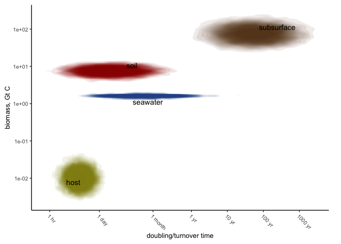

# Conceptual figure for aeonophile comment


# Biomass estimates

Biomass estimates directly from Bar-On et al (2018)[^1]. They have host
associated microbiome as negligible, and have deep subsurface microbiome
as almost the same for bacteria and archaea (actually the relative
abundance of Arcahea in the oceans is almost double that of Bacteria,
but it is small in both cases, so the difference doesn’t really matter.)

# Doubling times

## Host-associated

From Gibson et al 2018[^2] (doubling times in hours),

- E. coli in human UTI: 15 +/- 7.7
- P aeruginose in CF patient lungs: 2.3 +/- 0.77
- Salmonella enterica: 25 +/- 7.9
- Staphylococcus aureus: 1.87 +/- 0.98
- Vibrio cholerae: 1.1 +/- 2.6

I can’t work out with confidence what environments each of these are in,
since the paper doesn’t explicitly say and the references appear to be
borked (e.g. the E. coli reference seems to refer to P. aeruginosa)

From Kopf et al[^3], 18O-water measurements of growth rates of Staph
aureus in cystic fibrosis sputum: 50.4 hr.

## Seawater

From Kirchman[^4]: Coastal and open ocean growth rates are on the order
of 0.003 to 0.5 per day. Doubling time $t_d$ is given by

$$
t_d = \frac{\ln 2}{r}
$$ (when $r$ is expressed as a fraction of 1, not as percent). So this
gives doubling times in the range of 1.4-231 days.

## Soils

Zelenev et al (2000)[^5] used a model of root microbiomes and got a
growth rate of 0.065 per hour)
(DOI:10.1007/s002480000029)\[https://doi.org/10.1007/s002480000029\], or
0.44 hours.

Rivkina et al (2000)[^6] found “minimum doubling times” after addition
of 14C-acetate of 1 to 160 days (at 0 to -20 C, which maybe we should
exclude those data because of the low temperatures).

Rousk and Bååth (2011)[^7] found “turnover times” (which I don’t think
are carefully defined?) of 0.5 - 215 days (median ~6) for a range of
soils, mostly at 20 C, mostly measured with leucine incorporation.

# Code

``` r
# Sample data
library(tidyverse)
theme_set(theme_classic())

#####
# Useful functions
#####

# creates a lognormal distribution from a vector of x (independant) values, mu, and sigma
my_lognormal <- function(x, mu, sigma) {
  (1/(x*sigma*sqrt(2*pi)))*exp(-1*(log(x)-mu)^2/(2*sigma^2))
}

# fits a lognormal distribution to a vector of raw data
fit_lognormal <- function(raw.data, grid) {
  ln_fit <- MASS::fitdistr(raw.data, "log-normal")
  mu <- ln_fit$estimate["meanlog"]
  sigma <- ln_fit$estimate["sdlog"]
  
  density.values <- my_lognormal(x=grid, mu=mu, sigma=sigma)
  density_df <- tibble(x=grid,
                       density = density.values)
  density_df
}

# Function to calculate a grid of densities given
#.  given doubling time data and relative abundance data
# Probably badly overcomplicated
calc_joint_density <- function(doubling.data, 
                               doubling.grid = 10^(seq(from=log10(0.1), to=log10(87600000), length.out=100)), 
                               rel.abund.data, 
                               rel.abund.grid = seq(from=0.01, to=1, by=0.01),
                               envt = NULL) {
  # calc lognormal distributions for doubling times and relative abundances
  doubling_density <- fit_lognormal(raw.data = doubling.data, 
                                    grid = doubling.grid) |> 
    rename(c(doubling.time="x", doubling.density="density"))
  abundance_density <- fit_lognormal(raw.data = rel.abund.data, # this is bullshit made up numbers
                                     grid = rel.abund.grid) |> 
    rename(c(rel.abund="x", rel.abund.density="density"))
  
  # Calculate a joint density distribution from each distribution
  joint_density <- expand_grid(doubling_density, 
                               abundance_density) |> 
    mutate(joint.density = doubling.density * rel.abund.density, 
           norm.joint.density = joint.density/max(joint.density, na.rm=TRUE)) # this works!!!
  
  # Add a column for environment if need be
  if(!is.null(envt)) {
    joint_density <- joint_density |> 
      mutate(envt = as.character(envt))
  }
  
  joint_density
}

#######
# Necessary data
#######

# Data on doubling/turnover times for different environments
host <- c(1.1, 1.87, 2.3, 15, 25, 50.4)  # converted to days
soil <- c(0.44, 1*24, 160*24,6*24)
sw <- c(1.4*24, 231*24)
subsurf <- 24*365*c(3, 1000)


# What if I define a universal grid for all situations?
# rel abundance is easy - it shoudl got from 0 to 1, by 0.01 or 0.001, linearly
# Doubling time should be log-spaced - so it should go from 10^-1 hours to 
#    10,000 year * 365 days/year * 24 hours/day = 87,600,000
#    But it should be log spaced, so it should go evenly from log10(0.1) to log10(87,600,000)
#doubling.grid.univ <- 10^(seq(from=log10(0.1), to=log10(87600000), length.out=100))
#rel.abund.grid.univ <- seq(from=0.01, to=1, by=0.01)

#joint_density_host <- calc_joint_density(doubling.data = host,
#                                         rel.abund.data = c(0.01, 0.02, 0.03),
#                                         envt="host")
#joint_density_soil <- calc_joint_density(doubling.data = soil,
#                                         rel.abund.data = c(0.1, 0.2, 0.4),
#                                         envt="soil")
#joint_density_sw <- calc_joint_density(doubling.data = sw,
#                                       rel.abund.data = c(0.5, 0.6, 0.7),
#                                       envt="sw")

#densities <- rbind(joint_density_host, 
#                   joint_density_soil,
#                   joint_density_sw)


# What if I just sample from the lognormal distribution
n.points <- 10000
set.seed(2112)
# Doubling time: assume 30% uncertainty, in the absence of better information
soil.double.samps <- 10^rnorm(n=n.points, mean=mean(log10(soil)), 
                              sd=sd(log10(soil)/3))
sw.double.samps <- 10^rnorm(n=n.points, mean=mean(log10(sw)), 
                            sd=sd(log10(sw)/3))
host.double.samps <- 10^rnorm(n=n.points, mean=mean(log10(host)), 
                              sd=sd(log10(host)/3))
subsurf.double.samps <- 10^rnorm(n=n.points, mean=mean(log10(subsurf)), 
                                 sd=sd(log10(subsurf)/3))

soil.abund.samps <- 10^rnorm(n=n.points, mean=log10(7.5), 
                             sd=log10(7.5)/10) # ten percent uncertainty
sw.abund.samps <- 10^rnorm(n=n.points, mean=log10(1.6), 
                           sd=log10(1.6)/10) # ten percent uncertainty
host.abund.samps <- 10^rnorm(n=n.points, mean=log10(0.01), 
                             sd=abs(log10(0.01)/10)) # ten percent uncertainty
subsurf.abund.samps <- 10^rnorm(n=n.points, mean=log10(74), 
                                sd=log10(1.5)) # terrestrial subsurface is 20fold, marine susburface is 8fold

# OK so now I've got samples of all the environment doubling times and abundances
soils_df <- tibble(double=soil.double.samps, abund=soil.abund.samps, envt="soil")
sw_df <- tibble(double=sw.double.samps, abund=sw.abund.samps, envt="seawater")
host_df <- tibble(double=host.double.samps, abund=host.abund.samps, envt="host")
subsurf_df <- tibble(double=subsurf.double.samps, abund=subsurf.abund.samps, envt="subsurface" )
all <- rbind(soils_df, sw_df, host_df, subsurf_df) |> 
  slice_sample(prop = 1)

# Make labels for ggrepel; it's repetitive but I don't care
blob_labels <- all |> 
  group_by(envt) |> 
  summarise(mean.dt = mean(double, na.rm=TRUE),
            mean.abund = mean(abund, na.rm=TRUE))


# setup for plot
breaks.vec <- c(1, 24, 24*31, 24*365.25, 24*365.25*10, 24*365*100, 24*365*1000, 24*365*10000)
breaks.names <- c("1 hr", "1 day", "1 month", "1 yr", "10 yr", "100 yr", "1000 yr", "10,000 yr")
colors <- c("#908C13", "#2B5597", "#990000","#674422")

# the plot
ggplot(all, aes(x=double, y=abund)) + 
  stat_density_2d(
    aes(fill = envt, alpha = after_stat(level)), 
    geom = "polygon",
    color = NA,
    bins = 500
  ) + 
  scale_x_log10(name = "doubling/turnover time", 
                breaks = breaks.vec,
                labels = breaks.names) + 
  ggrepel::geom_text_repel(data=blob_labels, 
                            aes(x=mean.dt, y=mean.abund, label=envt)) +
  scale_y_log10(name = "biomass, Gt C") +
  scale_fill_manual(values = colors) + 
  theme(text = element_text(size = 10),
        legend.position = "none",
        axis.text.x = element_text(angle=-45, hjust=0),
        plot.margin = margin(0.1,0.25,0.1,0.1, "in"))
```



``` r
# ggsave("plots/fig_1_v2.pdf", height = 2.5, width=3.5, units = "in", dpi=450)
```

[^1]: Bar-On, Y.M., Phillips, R. and Milo, R., 2018. The biomass
    distribution on Earth. Proceedings of the National Academy of
    Sciences, 115(25), pp.6506-6511.

[^2]: Gibson, B., Wilson, D.J., Feil, E. and Eyre-Walker, A., 2018. The
    distribution of bacterial doubling times in the wild. Proceedings of
    the Royal Society B, 285(1880), p.20180789.

[^3]: Kopf, S.H., Sessions, A.L., Cowley, E.S., Reyes, C., Van Sambeek,
    L., Hu, Y., Orphan, V.J., Kato, R. and Newman, D.K., 2016. Trace
    incorporation of heavy water reveals slow and heterogeneous pathogen
    growth rates in cystic fibrosis sputum. Proceedings of the National
    Academy of Sciences, 113(2), pp.E110-E116.

[^4]: https://www.annualreviews.org/content/journals/10.1146/annurev-marine-122414-033938

[^5]: Zelenev, V.V., Van Bruggen, A.H.C. and Semenov, A.M., 2000.
    \`\`BACWAVE,’’a Spatial–Temporal Model for Traveling Waves of
    Bacterial Populations in Response to a Moving Carbon Source in Soil.
    Microbial ecology, 40, pp.260-272.

[^6]: Rivkina, E.M., Friedmann, E.I., McKay, C.P. and Gilichinsky, D.A.,
    2000. Metabolic activity of permafrost bacteria below the freezing
    point. Applied and environmental microbiology, 66(8), pp.3230-3233.

[^7]: Rousk, J. and Bååth, E., 2011. Growth of saprotrophic fungi and
    bacteria in soil. FEMS Microbiology Ecology, 78(1), pp.17-30.
